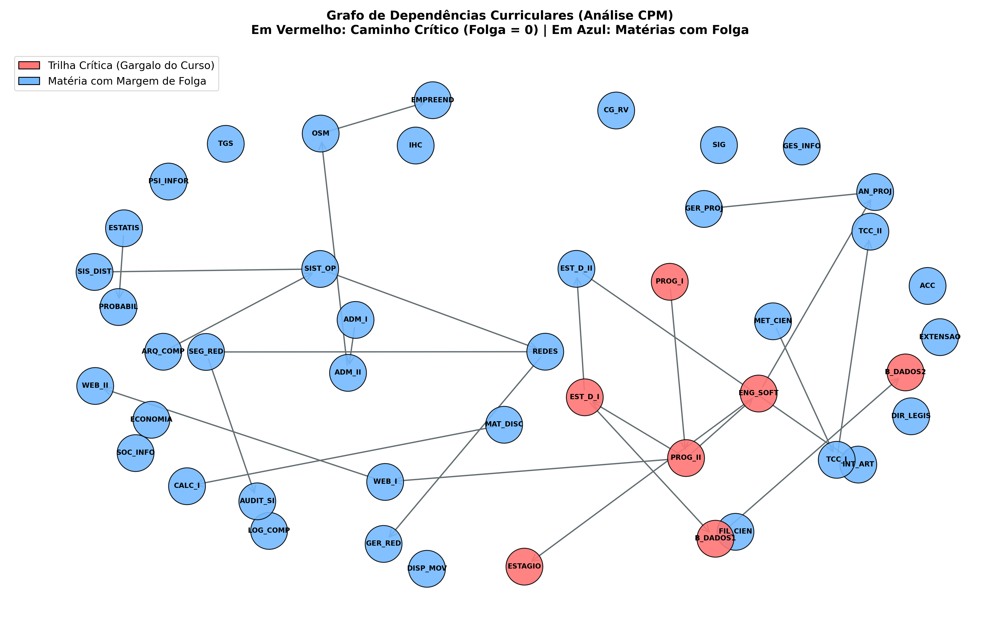
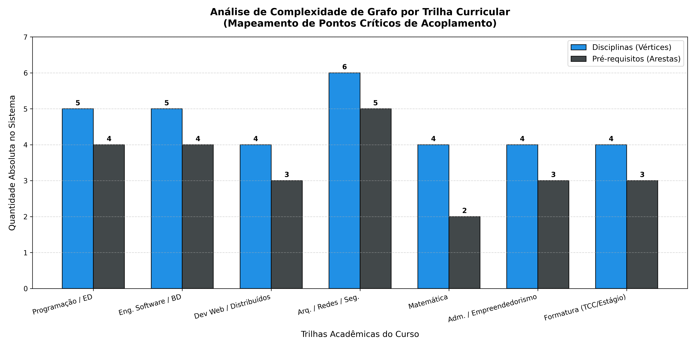

# Sistema de Análise de Fluxo Curricular via Grafos

Este projeto aplica conceitos avançados de Teoria dos Grafos e Estruturas de Dados para analisar a viabilidade, mapear o caminho crítico e simular cenários de relaxamento de pré-requisitos na matriz curricular do curso de Sistemas de Informação da Unifesspa.

O sistema valida a matriz como um Grafo Dirigido Acíclico (DAG), calcula folgas temporais usando o Método do Caminho Crítico (CPM) e analisa a complexidade computacional e de acoplamento por trilhas acadêmicas.

## 🛠️ Pré-requisitos e Dependências

O projeto foi desenvolvido em **Python 3.14.0** e utiliza bibliotecas nativas para os motores matemáticos, além de pacotes externos para coleta de métricas de hardware e renderização visual.

Todas as dependências estão no arquivo requirements.txt e podem ser instaladas pelo seguinte comando:

```bash
pip install -r requirements.txt
```

## 📂 Estrutura Final do Repositório

```
seminarioGrafosED2/
├── images/
├── teste.py               # Estrutura do grafo, algoritmos de ordenação topológica (Kahn e DFS) e motor CPM.
├── plotview.py            # Geração das visualizações gráficas utilizando NetworkX e Matplotlib.
├── requirements.txt       # Dependências do projeto
└── grade_sistemas_informacao_completa.csv
```

## 🎲 Descrição do Dataset

Foi estruturado, em formato CSV, a grade curricular oficial do curso de sistemas de Informação da Unifesspa com as disciplinas e suas respectivas dependências acadêmicas. O produto final foi um grafo composto por 45 vértices, que representam as disciplinas obrigatórias, e 25 arestas direcionadas, que representam a relação formal de pré-requisitos entre elas.

## 🚀 Executando o Programa

Para o correto funcionamento do experimento, adicione `grade_sistemas_informacao_completa.csv` (arquivo de dados contendo a listagem oficial de disciplinas, cargas horárias e módulos da matriz curricular) na raiz do projeto.

### 1. Executar os Benchmarks e Simulações (```teste.py```):

O que este módulo faz:

* Verifica a aciclidade do grafo (detecção de loops).

* Gera as ordenações topológicas via DFS (Baseline) e Kahn (Principal).

* Executa a análise de sensibilidade temporal comparando a matriz base com 4 cenários de relaxamento (Cenários A, B, C e D).

* Imprime uma tabela consolidada de métricas no terminal acompanhada das especificações técnicas da CPU e memória RAM utilizadas no teste.

### 2. Gerar a Visualização do Grafo e Gráficos de Complexidade (```viewplot.py```)



